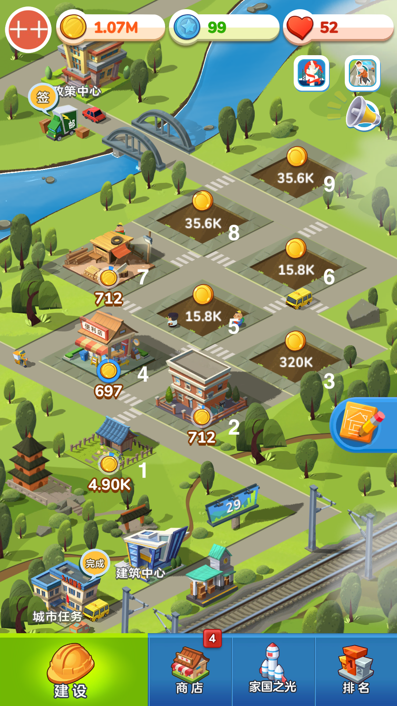

# JGM Automator

> 基于[https://github.com/Jiahonzheng/JGM-Automator](https://github.com/Jiahonzheng/JGM-Automator) 的修改版
>
> 这是基于 OpenCV 模板匹配的《家国梦》游戏自动化脚本。

## 安装与运行

```bash
# 安装依赖
# 如果是新安装的python别忘记设置国内源，否则很难安装成功
python -m pip install uiautomator2 opencv-python

# adb 连接
# 如果是使用 MuMu 模拟器，那么adb连接地址就是127.0.0.1:7555，其他模拟器地址请自行查阅，建议设置模拟器屏幕大小为 1280（长） * 720（宽）
adb connect 127.0.0.1:7555

# 获取 device 名称,并填写至 main.py
adb devices

# 在已完成 adb 连接后，在手机安装 ATX 应用
python -m uiautomator2 init

# 打开 ATX ，点击“启动 UIAutomator”选项，确保 UIAutomator 是运行的。

# 如果你的模拟器屏幕大小不是1280*720，那么你还需要调整main.py中的4个数字（左下建筑-编号为1的建筑，右上建筑-编号为9的建筑，获取坐标的方法：模拟器-设置-开发者选项-指针位置-开启，然后在模拟器中按住鼠标时即可看到模拟器屏幕顶部有X坐标和Y坐标）

# 进入游戏页面，启动自动脚本。
python main.py
```

## 说明

+ 拉货配置

使用模拟器的截图功能（不要在外面使用QQ、微信等工具直接对模拟器界面截图，一定要使用模拟器本身的截图功能），将小火车停靠时的货物图片截图（截图时建议不要使用最后一节车厢的图片，那里有一片雾，会影响图片识别），然后参考`targets`目录里面的图片大小来截取需要图片并保存到`targets`目录下。

文件名规则：`<对应建筑位置1-9>-<建筑品质1-3>-其他信息`，如：`1-2-HuaYuanYangFang.png`，注意：文件名不能使用中文，`1`表示这个货物对应1号建筑，`2`表示这个建筑的品质是紫色建筑（1-蓝色建筑；2-紫色建筑；3-橙色建筑）。

+ 多配置

默认使用`python main.py`启动脚本，这时会自动匹配targets目录下的图片文件，如果你有多个号，也可以使用`python main.py <targets>`来启动，`<targets>`代表图片文件目录（注意不能使用中文）。

+ 运行日志

脚本运行时默认在`targets/log`目录下生成日期对应的日志文件，简单记录拉货次数及时间，脚本启动时会尝试从当天的日志文件中读取到上次拉货次数（0点后会重新计数）

+ 运行界面


+ 建筑编号


